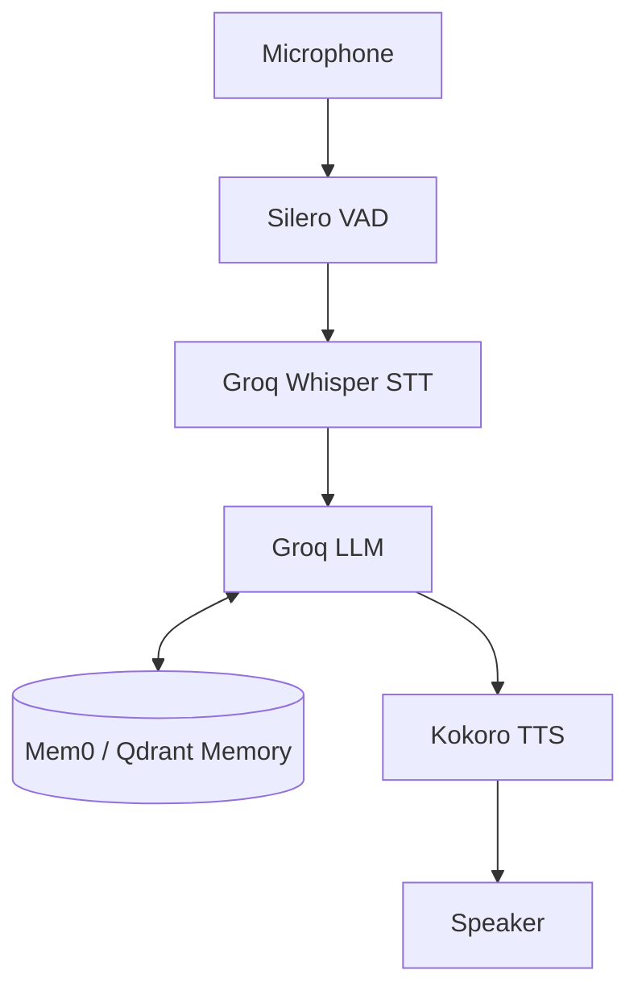

# English Tutor AI

Real-time voice conversational AI English tutor with long-term memory.

## Architecture

This project uses a real-time voice pipeline built with Pipecat:
- **Microphone** -> Audio Input
- **Silero VAD** -> Voice Activity Detection
- **Groq Whisper** -> Speech-to-Text (STT)
- **Groq LLM** -> Language Model
- **Kokoro TTS** -> Text-to-Speech
- **Speaker** -> Audio Output
- **Mem0** -> Long-term memory for personalized learning



## Features
- **Real-Time Voice**: Low-latency conversational interactions.
- **Grammar Correction**: Live feedback on spoken English mistakes.
- **Fact-Checking**: Corrects factual inaccuracies.
- **Barge-in Interruption**: The user can interrupt the tutor while it's speaking.
- **Personalized Memory**: Remembers past mistakes, strengths, and interests across sessions.

## Prerequisites
- Python 3.13+
- [uv](https://github.com/astral-sh/uv) package manager
- A working microphone and speaker

## Quick Start

1. Clone and change into the project directory:
   ```bash
   git clone <repository_url>
   cd english_tutor_ai
   ```

2. Setup environment variables:
   Copy `.env.example` to `.env` and add your `GROQ_API_KEY`.
   ```bash
   cp .env.example .env
   ```

3. Install dependencies using `uv`:
   ```bash
   uv sync
   ```

4. Run the application:
   ```bash
   uv run python src/main.py
   ```

## Configuration

| Environment Variable | Description | Default |
|----------------------|-------------|---------|
| `GROQ_API_KEY` | **Required**. API key for Groq services | (None) |
| `AUDIO_IN_SAMPLE_RATE` | Audio input sample rate | `16000` |
| `AUDIO_OUT_SAMPLE_RATE`| Audio output sample rate | `24000` |
| `VAD_STOP_SECS` | Seconds of silence to trigger stop | `0.6` |
| `USER_ID` | Identifier for memory retrieval | `default_student_1` |
| `QDRANT_PATH` | Path for local vector storage | `./qdrant_storage` |

## Testing
To run tests:
```bash
uv run pytest tests/ -v
```
